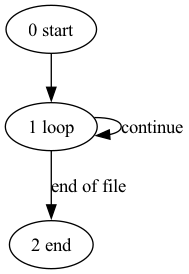

# MTdV-syntax-analyzer
## Présentation du projet

Ce projet est un analyseur syntaxique pour l'inscription MTdV. Il a pour objectif de vérifier la syntaxe des programmes écrits dans ce langage et de signaler les erreurs éventuelles. Les résultats de l'analyse sont également stockés dans un fichier json et la structure du programme est visualisée sous la forme d'une image png.

## membre du groupe
Siman Chen [@simannnc](https://github.com/simannnc)

Yutian Shen [@ShenYT0](https://github.com/ShenYT0)

### Fonctionnalités

- Vérification de la syntaxe des programmes MTdV et transformer la structure du programme en une graphe
- Signalement des erreurs de syntaxe avec des messages clairs
- Sauvegarder la structure du diagramme dans un fichier json et générer une image de visualisation

### Règles de MTdV:
| Instruction | Sémantique                                                                                                                                                        |
|-------------|-------------------------------------------------------------------------------------------------------------------------------------------------------------------|
| **I**       | affiche l’état de la machine                                                                                                                                    |
| **P**       | « pause », interrompt temporairement l’exécution du programme ; celle-ci reprend une fois que l’utilisateur a tapé sur une touche du clavier en réponse au prompt affiché. |
| **G, D**    | déplace la tête de lecture respectivement d’une position à Gauche, à Droite                                                                                      |
| **0, 1**    | écrit respectivement un 0 (case vide) ou un 1 (bâton) à l’emplacement de la tête de lecture                                                                      |
| **si (0)**  | si la tête de lecture est sur une case vide alors les instructions x1, x2, ... sont exécutées en séquence, sinon exécute la première instruction qui suit l’accolade fermante } |
| **si (1)**  | même chose dans le cas où la tête de lecture est positionnée sur un bâton                                                                                       |
| **boucle**  | répète la séquence d’instructions x1, x2 ..., jusqu’à ce que l’une d’elle soit l’instruction fin                                                                 |
| **fin**     | rompt le cycle de répétition d’une boucle en faisant exécuter la première instruction qui suit l’accolade fermante de la première boucle contenant l’instruction fin ; si fin n’est contenue dans aucune boucle alors le programme s’arrête. |
| **%**       | définit une ligne de commentaire non exécutable                                                                                                                 |
| **#**       | marqueur de fin de fichier requis comme dernière instruction                                                                                                    |                                                                                                |

### Prérequis

- Python 3.9+
- Bibliothèques nécessaires (voir `requirements.txt`)

### Utilisation

Pour analyser un fichier MTdV, utilisez la commande suivante :

```bash
python analyzer.py chemin/vers/votre/fichier.TS -o chemin/vous/voulez/enregistrer
```

### Résultat

Un fichier `json` contient des informations sur le diagramme transformé par le programme, ainsi qu'une image au format `png` qui visualise le diagramme.

> Exemple: pour programme `infini.1.TS`
```
%  tourne indéfiniment 
boucle }

#

```
Il affiche une image qui présent la graphe:



et un fiche json:

```json
{
    "nodes": [
        {
            "id": 0,
            "inst": "start",
            "edges": [
                [
                    1,
                    ""
                ]
            ]
        },
        {
            "id": 1,
            "inst": "move left",
            "edges": [
                [
                    2,
                    ""
                ]
            ]
        },
        {
            "id": 2,
            "inst": "write 1",
            "edges": [
                [
                    3,
                    ""
                ]
            ]
        },
        {
            "id": 3,
            "inst": "move left",
            "edges": [
                [
                    4,
                    ""
                ]
            ]
        },
        {
            "id": 4,
            "inst": "write 1",
            "edges": [
                [
                    5,
                    ""
                ]
            ]
        },
        {
            "id": 5,
            "inst": "move left",
            "edges": [
                [
                    6,
                    ""
                ]
            ]
        },
        {
            "id": 6,
            "inst": "write 0",
            "edges": [
                [
                    7,
                    ""
                ]
            ]
        },
        {
            "id": 7,
            "inst": "move left",
            "edges": [
                [
                    8,
                    ""
                ]
            ]
        },
        {
            "id": 8,
            "inst": "write 1",
            "edges": [
                [
                    9,
                    ""
                ]
            ]
        },
        {
            "id": 9,
            "inst": "move left",
            "edges": [
                [
                    10,
                    ""
                ]
            ]
        },
        {
            "id": 10,
            "inst": "write 1",
            "edges": [
                [
                    11,
                    ""
                ]
            ]
        },
        {
            "id": 11,
            "inst": "loop",
            "edges": [
                [
                    12,
                    "start loop"
                ],
                [
                    32,
                    "end of file"
                ]
            ]
        },
        {
            "id": 12,
            "inst": "write 0",
            "edges": [
                [
                    13,
                    ""
                ]
            ]
        },
        {
            "id": 13,
            "inst": "move left",
            "edges": [
                [
                    14,
                    ""
                ]
            ]
        },
        {
            "id": 14,
            "inst": "write 1",
            "edges": [
                [
                    15,
                    ""
                ]
            ]
        },
        {
            "id": 15,
            "inst": "move left",
            "edges": [
                [
                    16,
                    ""
                ]
            ]
        },
        {
            "id": 16,
            "inst": "write 1",
            "edges": [
                [
                    17,
                    ""
                ]
            ]
        },
        {
            "id": 17,
            "inst": "loop",
            "edges": [
                [
                    18,
                    "start loop"
                ],
                [
                    21,
                    "end loop"
                ]
            ]
        },
        {
            "id": 18,
            "inst": "move right",
            "edges": [
                [
                    19,
                    ""
                ]
            ]
        },
        {
            "id": 19,
            "inst": "move right",
            "edges": [
                [
                    20,
                    ""
                ]
            ]
        },
        {
            "id": 20,
            "inst": "if read 1",
            "edges": [
                [
                    17,
                    "break"
                ],
                [
                    17,
                    "continue"
                ]
            ]
        },
        {
            "id": 21,
            "inst": "write 0",
            "edges": [
                [
                    22,
                    ""
                ]
            ]
        },
        {
            "id": 22,
            "inst": "move right",
            "edges": [
                [
                    23,
                    ""
                ]
            ]
        },
        {
            "id": 23,
            "inst": "write 1",
            "edges": [
                [
                    24,
                    ""
                ]
            ]
        },
        {
            "id": 24,
            "inst": "move right",
            "edges": [
                [
                    25,
                    ""
                ]
            ]
        },
        {
            "id": 25,
            "inst": "write 1",
            "edges": [
                [
                    26,
                    ""
                ]
            ]
        },
        {
            "id": 26,
            "inst": "loop",
            "edges": [
                [
                    27,
                    "start loop"
                ],
                [
                    30,
                    "end loop"
                ]
            ]
        },
        {
            "id": 27,
            "inst": "move left",
            "edges": [
                [
                    28,
                    ""
                ]
            ]
        },
        {
            "id": 28,
            "inst": "move left",
            "edges": [
                [
                    29,
                    ""
                ]
            ]
        },
        {
            "id": 29,
            "inst": "if read 1",
            "edges": [
                [
                    26,
                    "break"
                ],
                [
                    26,
                    "continue"
                ]
            ]
        },
        {
            "id": 30,
            "inst": "print machine state",
            "edges": [
                [
                    31,
                    ""
                ]
            ]
        },
        {
            "id": 31,
            "inst": "pause",
            "edges": [
                [
                    11,
                    "continue"
                ]
            ]
        },
        {
            "id": 32,
            "inst": "end",
            "edges": []
        }
    ]
}
```
